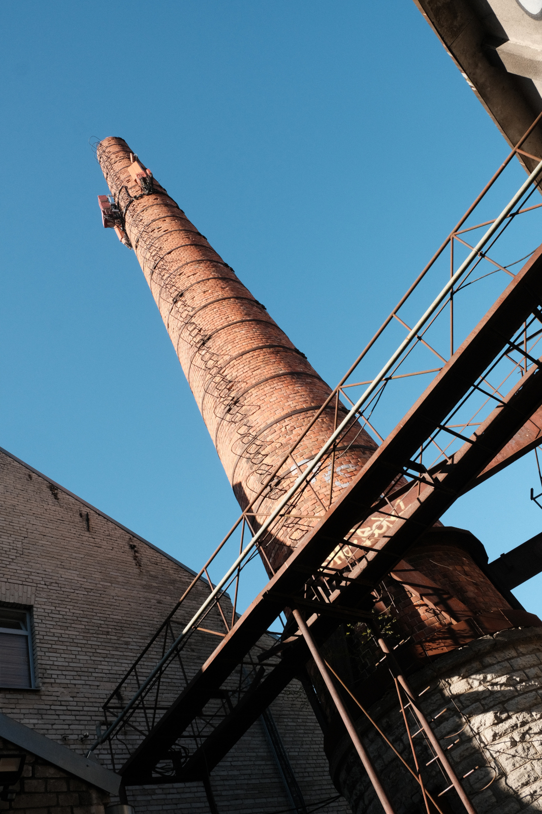
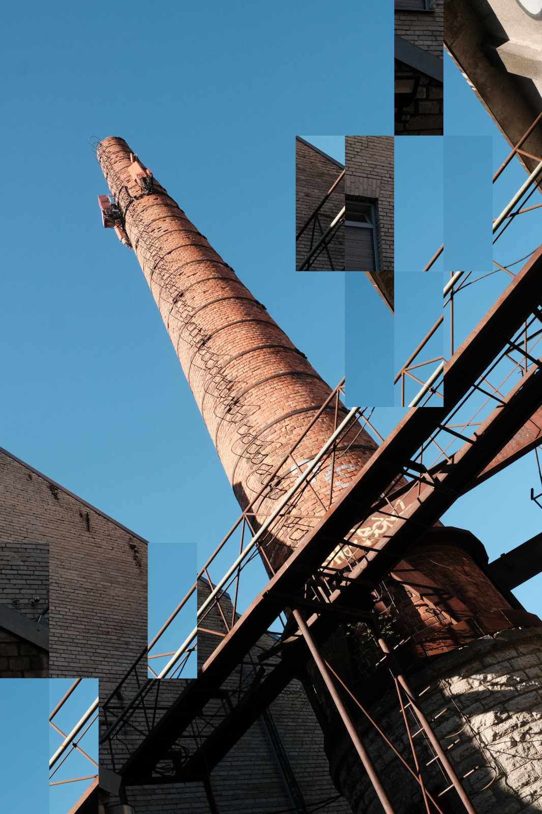

# Photo Tile Shuffle

Split a JPEG into a grid, shuffle some of the tiles, and save full-resolution variants. Everything runs locally in the browser — open `index.html` and pick a photo.

## Example

The same chimney, before and after. The photo is cut into a grid and some tiles trade places; the rest stay where they were. Here, pieces of sky, brick, and metal have moved.

| Before | After |
| --- | --- |
|  |  |

## Usage

1. Choose a JPEG.
2. Set **HOR** (columns) and **VER** (rows). Leftover pixels on the right or bottom are cropped so tiles stay even.
3. Set **CHAOS** — how much of the image to rearrange (`0` = none, `1` = all). Check **apply subtle chaos** to swap similar-looking tiles instead of random ones.
4. Optionally paint the preview to limit which tiles can move: left-drag to paint, right-drag to erase (Command-click on Mac). `[` / `]` change brush size; Ctrl+Z undoes the last stroke. Leave it unpainted to shuffle anywhere.
5. Set how many variants to generate (**N_OUT**). Add a **SEED** if you want repeatable results.
6. Click **Generate**, then **Save JPEG** on the variants you want.
