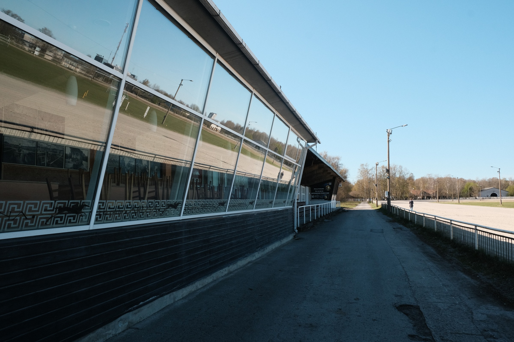
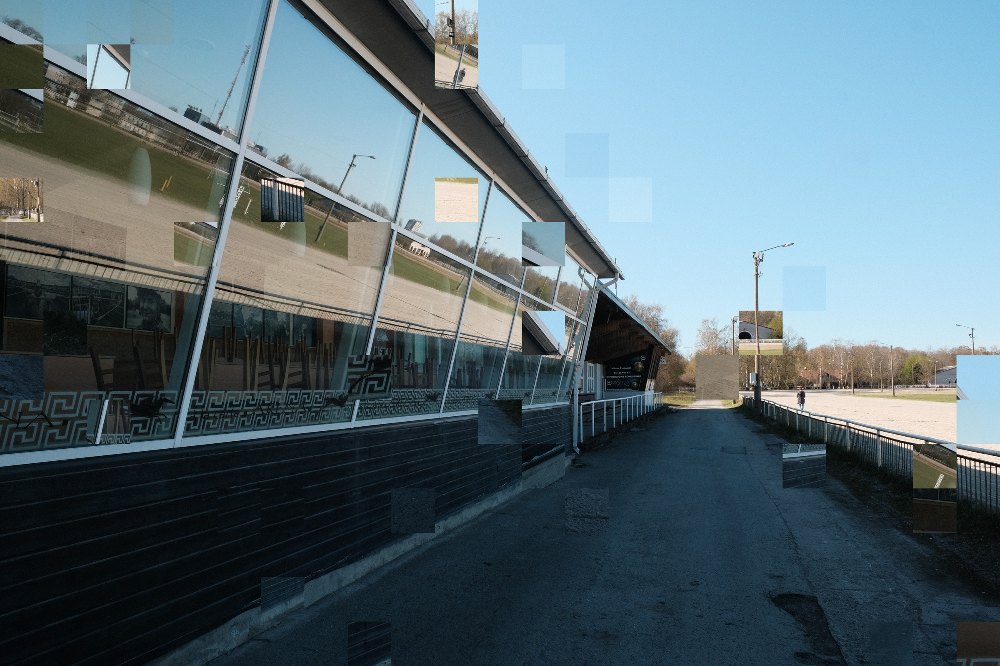
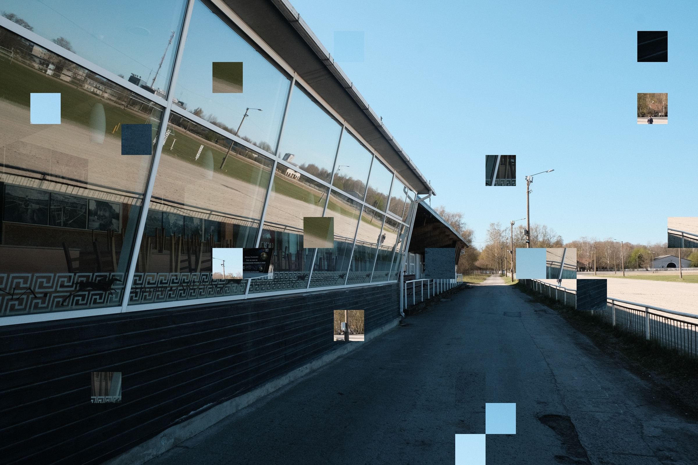
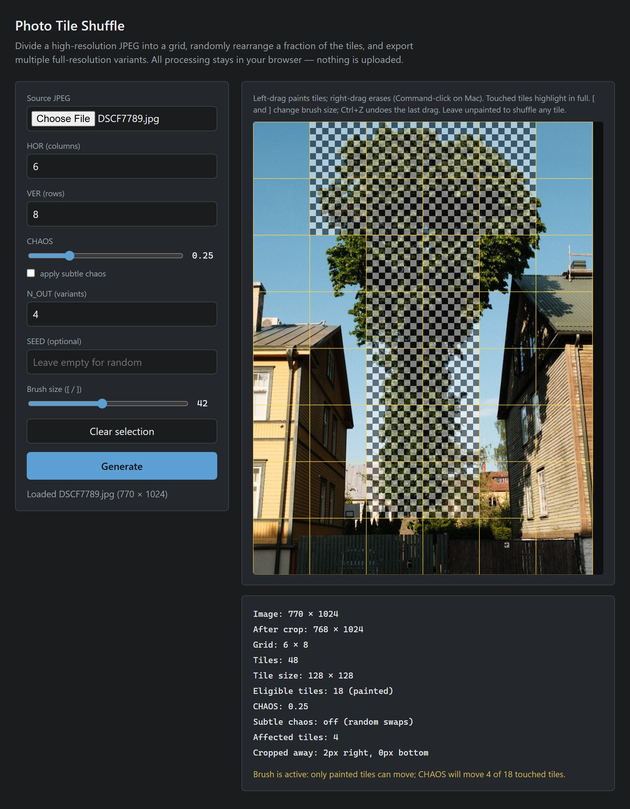

# Photo Tile Shuffle

Split a JPEG into a grid, shuffle some of the tiles, and save full-resolution variants. Everything runs locally in the browser — open `index.html` and pick a photo.

## Examples

### Chimney

The same chimney, before and after. The photo is cut into a grid and some tiles trade places; the rest stay where they were. Here, pieces of sky, brick, and metal have moved.

| Before | After |
| --- | --- |
|  |  |

### Building

The same glass building, shuffled two ways. With **apply subtle chaos** and CHAOS `0.12`, more tiles move, but each one swaps with a similar tile, so sky stays near sky and glass near glass. With subtle chaos off and CHAOS `0.06`, fewer tiles move, and a tile can land anywhere — a piece of wall can show up in the sky.

| Before | Subtle chaos, 0.12 | No subtle chaos, 0.06 |
| --- | --- | --- |
|  |  |  |

## Masking

Paint the preview to choose which tiles may move. The brush is a circle: every tile it touches is selected, and the preview fills that whole tile with a checker. Tiles you never touch stay where they are.

CHAOS then applies only to the painted tiles, not to the whole photo. Below, the tree is painted on a 6 × 8 grid — 18 tiles. At CHAOS `0.25`, four of those eighteen can move. The houses are outside the mask, so they stay put. Leave the preview unpainted and every tile is eligible.

Left-drag paints and right-drag erases (Command-click on Mac). `[` and `]` change the brush size. Ctrl+Z undoes the last stroke. **Clear selection** removes the mask.

## Usage

1. Choose a JPEG.
2. Set **HOR** (columns) and **VER** (rows). Leftover pixels on the right or bottom are cropped so tiles stay even.
3. Set **CHAOS** — how much of the image to rearrange (`0` = none, `1` = all). Check **apply subtle chaos** to swap similar-looking tiles instead of random ones.
4. Optionally paint the preview to limit which tiles can move: left-drag to paint, right-drag to erase (Command-click on Mac). `[` / `]` change brush size; Ctrl+Z undoes the last stroke. Leave it unpainted to shuffle anywhere.
5. Set how many variants to generate (**N_OUT**). Add a **SEED** if you want repeatable results.
6. Click **Generate**, then **Save JPEG** on the variants you want.
